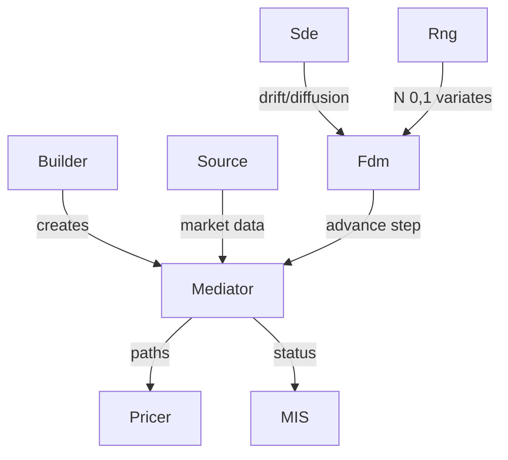

Monte Carlo option pricing engine in C++11 & C++20 — policy-based design vs concepts, virtual-free hot loop, parallel fork-join

```mermaid
flowchart TB
    Builder -->|creates| Mediator
    Mediator -->|paths| Pricer
    Mediator -->|status| MIS
    Source -->|market data| Mediator
    Sde -->|drift/diffusion| Fdm
    Fdm -->|advance step| Mediator
    Rng -->|N 0,1 variates| Fdm
```